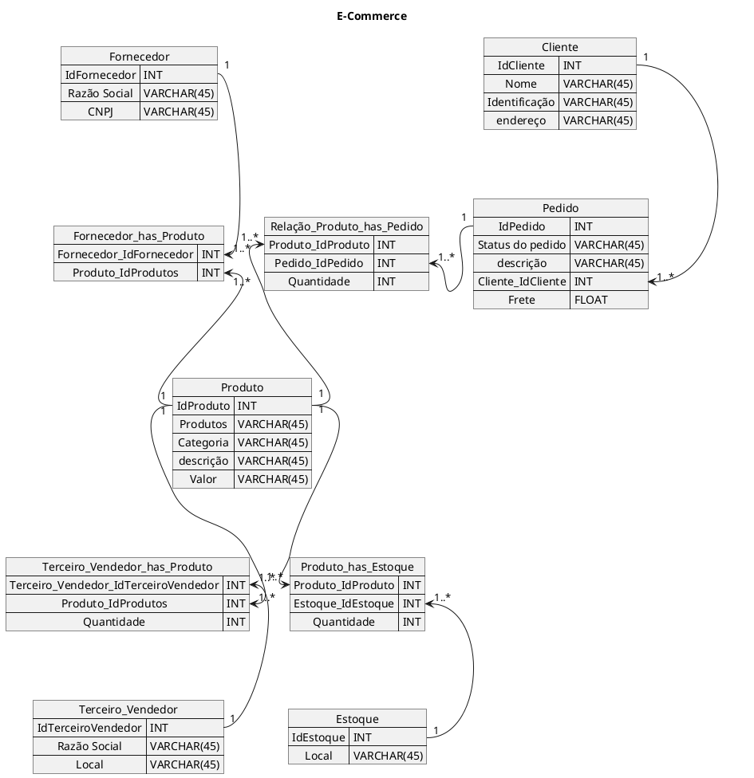

# BD-E-COMMERCE

### É um projeto conceitual de banco de dados E-COMMERCE

##### Diagrama Plantuml

```plantuml
@startuml


title E-Commerce

/' Tabela Cliente '/
map Cliente {
IdCliente => INT
Nome => VARCHAR(45)
Identificação => VARCHAR(45)
endereço => VARCHAR(45)
}

/' Tabela Pedido'/
map Pedido {
IdPedido => INT
Status do pedido => VARCHAR(45)
descrição => VARCHAR(45)
Cliente_IdCliente => INT
Frete => FLOAT
}

/' Tabela Produtos'/
map Produto {
IdProduto => INT
Produtos => VARCHAR(45)
Categoria => VARCHAR(45)
descrição => VARCHAR(45)
Valor => VARCHAR(45)
}

/' Tabela Fornecedor '/
map Fornecedor {
IdFornecedor => INT
Razão Social => VARCHAR(45)
CNPJ => VARCHAR(45)
}

/' Tabela Terceiro Vendedor'/
map Terceiro_Vendedor {
IdTerceiroVendedor => INT
Razão Social => VARCHAR(45)
Local => VARCHAR(45)
}

/' Tabela Estoque '/
map Estoque {
IdEstoque => INT
Local => VARCHAR(45)
}

/' Tabela de Relacionameto Produto e Cliente'/
map Relação_Produto_has_Pedido{
Produto_IdProduto => INT
Pedido_IdPedido  => INT
Quantidade => INT
}

/' Tabela de Relacionameto Produto e Fornecedor'/
map Fornecedor_has_Produto {
Fornecedor_IdFornecedor => INT
Produto_IdProdutos => INT
}

/' Tabela de Relacionameto Produto e Terceiro Vendedor'/
map Terceiro_Vendedor_has_Produto {
Terceiro_Vendedor_IdTerceiroVendedor => INT
Produto_IdProdutos => INT
Quantidade => INT
}

/' Tabela de Relacionameto Produto e Estoque'/
map Produto_has_Estoque{
Produto_IdProduto => INT
Estoque_IdEstoque => INT
Quantidade => INT
}

/'Relacionamento com Cliente e Pedido '/
Cliente::IdCliente -down-> Pedido::Cliente_IdCliente: "1" " 1..*" 

/'Relacionamento com Produto e Pedido '/
Produto::IdProduto -up-> Relação_Produto_has_Pedido::Produto_IdProduto : "1" " 1..*"
Pedido::IdPedido -left-> Relação_Produto_has_Pedido::Pedido_IdPedido : "1" " 1..*"

/'Relacionamento com Produto e Estoque'/
Produto::IdProduto -down-> Produto_has_Estoque::Produto_IdProduto : "1" " 1..*"
Estoque::IdEstoque  -up-> Produto_has_Estoque::Estoque_IdEstoque : "1" " 1..*"

/'Relacionamento com Produto e Fornecedor'/
Produto::IdProduto -up-> Fornecedor_has_Produto::Produto_IdProdutos : "1" " 1..*"
Fornecedor::IdFornecedor -down-> Fornecedor_has_Produto::Fornecedor_IdFornecedor : "1" " 1..*"

/'Relacionamento com Produto e Terceiro Vendedor'/
Produto::IdProduto -down-> Terceiro_Vendedor_has_Produto::Produto_IdProdutos: "1" " 1..*"
Terceiro_Vendedor::IdTerceiroVendedor -up-> Terceiro_Vendedor_has_Produto::Terceiro_Vendedor_IdTerceiroVendedor : "1" " 1..*"

@enduml
```
